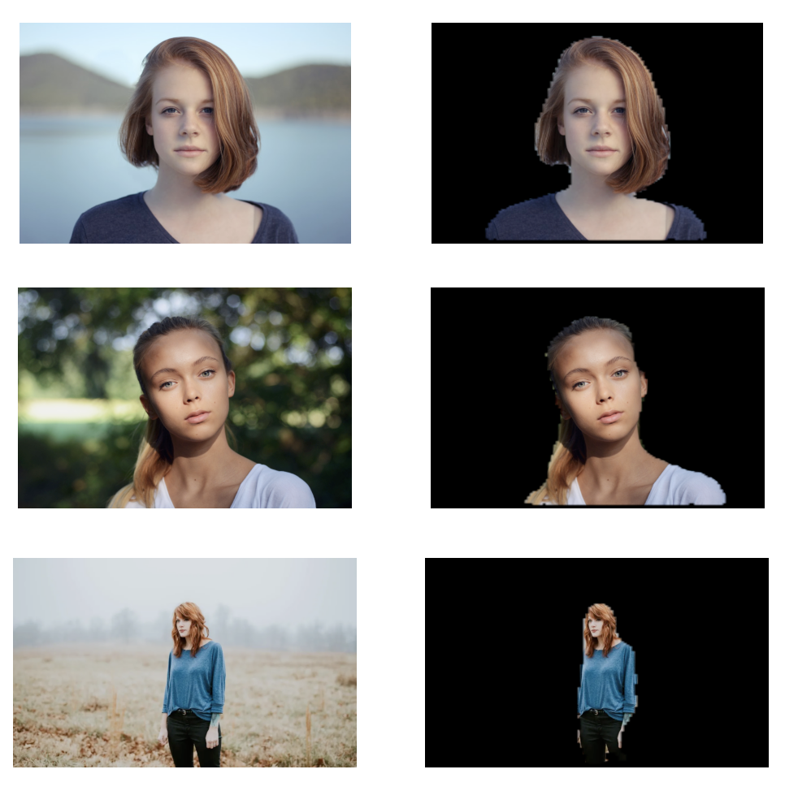

# background-remover

A deep U-net neural network that uses semantic segmentation to identity the background of a portrait image!

The model reached a binary accuracy of ~90% and an IoU of ~65% on the test set over around 50 epochs of training on 6000 images.

Walk through a demonstration using the following link: https://colab.research.google.com/drive/19zZupsuejVLYtzib_6qZU2TCrIvKUWuj?usp=sharing.



## Dataset
The <a href='https://cocodataset.org/#home'>COCO Dataset</a> was used to train the model.

Since the target images are portraits, only the COCO images with one person with area between 20 and 70 percent of the entire image were kept. No data augmentation was used.

## Reproducing Steps
1. Run `git clone https://github.com/samliu21/background-remover`. This will create a folder called `background-remover` containing most of the necessary files.
2. Download `train_img`, `train_mask`, `val_img`, and `val_mask` from the following Google Drive: https://drive.google.com/drive/folders/1jtBTz1Nc9USNIkUnLCOraa-CaP4z61SW?usp=sharing. These folders contain the training data for the model.
3. Move these files into the `background-remover` folder.
4. Move into the folder using `cd background-remover`.
5. `conda create --name bgrm --file requirements.txt`
6. `conda activate bgrm`
7. `python train.py` to start training!

## Files
- `model.py` and `model_parts.py` contain the U-net model
- `coco.py` is used to preprocess and filter to COCO dataset
- `train.py` is used to train the U-net
- `results.py` is used to visualize the results of the model

## Model

We used the classic U-net model: a series of convolutions followed by transpose convolutions to reduce, then increase the dimensions of the image. Residual connections are used to propagate earlier weights later into the model to help with backward propagation. 

Since the network is fully convolutional, the U-net can take images of any image dimension. The only requirement is that the width and length are multiples of 32. 

The model was trained on 128 x 128 images. Thus, the dimensions of an inputted image are reduced to 128 x 128. The outputted mask is then scaled back to the original dimensions of the image. 

```
__________________________________________________________________________________________________
Layer (type)                    Output Shape         Param #     Connected to                     
==================================================================================================
input_1 (InputLayer)            [(None, 128, 128, 3) 0                                            
__________________________________________________________________________________________________
max_pooling2d (MaxPooling2D)    (None, 64, 64, 3)    0           input_1[0][0]                    
__________________________________________________________________________________________________
conv2d (Conv2D)                 (None, 64, 64, 64)   1792        max_pooling2d[0][0]              
__________________________________________________________________________________________________
dropout (Dropout)               (None, 64, 64, 64)   0           conv2d[0][0]                     
__________________________________________________________________________________________________
batch_normalization (BatchNorma (None, 64, 64, 64)   256         dropout[0][0]                    
__________________________________________________________________________________________________
activation (Activation)         (None, 64, 64, 64)   0           batch_normalization[0][0]        
__________________________________________________________________________________________________
conv2d_1 (Conv2D)               (None, 64, 64, 64)   36928       activation[0][0]                 
__________________________________________________________________________________________________
dropout_1 (Dropout)             (None, 64, 64, 64)   0           conv2d_1[0][0]                   
__________________________________________________________________________________________________
batch_normalization_1 (BatchNor (None, 64, 64, 64)   256         dropout_1[0][0]                  
__________________________________________________________________________________________________
activation_1 (Activation)       (None, 64, 64, 64)   0           batch_normalization_1[0][0]      
__________________________________________________________________________________________________
max_pooling2d_1 (MaxPooling2D)  (None, 32, 32, 64)   0           activation_1[0][0]               
__________________________________________________________________________________________________
conv2d_2 (Conv2D)               (None, 32, 32, 128)  73856       max_pooling2d_1[0][0]            
__________________________________________________________________________________________________
dropout_2 (Dropout)             (None, 32, 32, 128)  0           conv2d_2[0][0]                   
__________________________________________________________________________________________________
batch_normalization_2 (BatchNor (None, 32, 32, 128)  512         dropout_2[0][0]                  
__________________________________________________________________________________________________
activation_2 (Activation)       (None, 32, 32, 128)  0           batch_normalization_2[0][0]      
__________________________________________________________________________________________________
conv2d_3 (Conv2D)               (None, 32, 32, 128)  147584      activation_2[0][0]               
__________________________________________________________________________________________________
dropout_3 (Dropout)             (None, 32, 32, 128)  0           conv2d_3[0][0]                   
__________________________________________________________________________________________________
batch_normalization_3 (BatchNor (None, 32, 32, 128)  512         dropout_3[0][0]                  
__________________________________________________________________________________________________
activation_3 (Activation)       (None, 32, 32, 128)  0           batch_normalization_3[0][0]      
__________________________________________________________________________________________________
max_pooling2d_2 (MaxPooling2D)  (None, 16, 16, 128)  0           activation_3[0][0]               
__________________________________________________________________________________________________
conv2d_4 (Conv2D)               (None, 16, 16, 256)  295168      max_pooling2d_2[0][0]            
__________________________________________________________________________________________________
dropout_4 (Dropout)             (None, 16, 16, 256)  0           conv2d_4[0][0]                   
__________________________________________________________________________________________________
batch_normalization_4 (BatchNor (None, 16, 16, 256)  1024        dropout_4[0][0]                  
__________________________________________________________________________________________________
activation_4 (Activation)       (None, 16, 16, 256)  0           batch_normalization_4[0][0]      
__________________________________________________________________________________________________
conv2d_5 (Conv2D)               (None, 16, 16, 256)  590080      activation_4[0][0]               
__________________________________________________________________________________________________
dropout_5 (Dropout)             (None, 16, 16, 256)  0           conv2d_5[0][0]                   
__________________________________________________________________________________________________
batch_normalization_5 (BatchNor (None, 16, 16, 256)  1024        dropout_5[0][0]                  
__________________________________________________________________________________________________
activation_5 (Activation)       (None, 16, 16, 256)  0           batch_normalization_5[0][0]      
__________________________________________________________________________________________________
max_pooling2d_3 (MaxPooling2D)  (None, 8, 8, 256)    0           activation_5[0][0]               
__________________________________________________________________________________________________
conv2d_6 (Conv2D)               (None, 8, 8, 512)    1180160     max_pooling2d_3[0][0]            
__________________________________________________________________________________________________
dropout_6 (Dropout)             (None, 8, 8, 512)    0           conv2d_6[0][0]                   
__________________________________________________________________________________________________
batch_normalization_6 (BatchNor (None, 8, 8, 512)    2048        dropout_6[0][0]                  
__________________________________________________________________________________________________
activation_6 (Activation)       (None, 8, 8, 512)    0           batch_normalization_6[0][0]      
__________________________________________________________________________________________________
conv2d_7 (Conv2D)               (None, 8, 8, 512)    2359808     activation_6[0][0]               
__________________________________________________________________________________________________
dropout_7 (Dropout)             (None, 8, 8, 512)    0           conv2d_7[0][0]                   
__________________________________________________________________________________________________
batch_normalization_7 (BatchNor (None, 8, 8, 512)    2048        dropout_7[0][0]                  
__________________________________________________________________________________________________
activation_7 (Activation)       (None, 8, 8, 512)    0           batch_normalization_7[0][0]      
__________________________________________________________________________________________________
max_pooling2d_4 (MaxPooling2D)  (None, 4, 4, 512)    0           activation_7[0][0]               
__________________________________________________________________________________________________
conv2d_8 (Conv2D)               (None, 4, 4, 512)    2359808     max_pooling2d_4[0][0]            
__________________________________________________________________________________________________
dropout_8 (Dropout)             (None, 4, 4, 512)    0           conv2d_8[0][0]                   
__________________________________________________________________________________________________
batch_normalization_8 (BatchNor (None, 4, 4, 512)    2048        dropout_8[0][0]                  
__________________________________________________________________________________________________
activation_8 (Activation)       (None, 4, 4, 512)    0           batch_normalization_8[0][0]      
__________________________________________________________________________________________________
conv2d_9 (Conv2D)               (None, 4, 4, 512)    2359808     activation_8[0][0]               
__________________________________________________________________________________________________
dropout_9 (Dropout)             (None, 4, 4, 512)    0           conv2d_9[0][0]                   
__________________________________________________________________________________________________
batch_normalization_9 (BatchNor (None, 4, 4, 512)    2048        dropout_9[0][0]                  
__________________________________________________________________________________________________
activation_9 (Activation)       (None, 4, 4, 512)    0           batch_normalization_9[0][0]      
__________________________________________________________________________________________________
conv2d_transpose (Conv2DTranspo (None, 8, 8, 512)    2359808     activation_9[0][0]               
__________________________________________________________________________________________________
tf.concat (TFOpLambda)          (None, 8, 8, 1024)   0           conv2d_transpose[0][0]           
                                                                 activation_7[0][0]               
__________________________________________________________________________________________________
conv2d_10 (Conv2D)              (None, 8, 8, 512)    4719104     tf.concat[0][0]                  
__________________________________________________________________________________________________
dropout_10 (Dropout)            (None, 8, 8, 512)    0           conv2d_10[0][0]                  
__________________________________________________________________________________________________
batch_normalization_10 (BatchNo (None, 8, 8, 512)    2048        dropout_10[0][0]                 
__________________________________________________________________________________________________
activation_10 (Activation)      (None, 8, 8, 512)    0           batch_normalization_10[0][0]     
__________________________________________________________________________________________________
conv2d_11 (Conv2D)              (None, 8, 8, 512)    2359808     activation_10[0][0]              
__________________________________________________________________________________________________
dropout_11 (Dropout)            (None, 8, 8, 512)    0           conv2d_11[0][0]                  
__________________________________________________________________________________________________
batch_normalization_11 (BatchNo (None, 8, 8, 512)    2048        dropout_11[0][0]                 
__________________________________________________________________________________________________
activation_11 (Activation)      (None, 8, 8, 512)    0           batch_normalization_11[0][0]     
__________________________________________________________________________________________________
conv2d_transpose_1 (Conv2DTrans (None, 16, 16, 256)  1179904     activation_11[0][0]              
__________________________________________________________________________________________________
tf.concat_1 (TFOpLambda)        (None, 16, 16, 512)  0           conv2d_transpose_1[0][0]         
                                                                 activation_5[0][0]               
__________________________________________________________________________________________________
conv2d_12 (Conv2D)              (None, 16, 16, 256)  1179904     tf.concat_1[0][0]                
__________________________________________________________________________________________________
dropout_12 (Dropout)            (None, 16, 16, 256)  0           conv2d_12[0][0]                  
__________________________________________________________________________________________________
batch_normalization_12 (BatchNo (None, 16, 16, 256)  1024        dropout_12[0][0]                 
__________________________________________________________________________________________________
activation_12 (Activation)      (None, 16, 16, 256)  0           batch_normalization_12[0][0]     
__________________________________________________________________________________________________
conv2d_13 (Conv2D)              (None, 16, 16, 256)  590080      activation_12[0][0]              
__________________________________________________________________________________________________
dropout_13 (Dropout)            (None, 16, 16, 256)  0           conv2d_13[0][0]                  
__________________________________________________________________________________________________
batch_normalization_13 (BatchNo (None, 16, 16, 256)  1024        dropout_13[0][0]                 
__________________________________________________________________________________________________
activation_13 (Activation)      (None, 16, 16, 256)  0           batch_normalization_13[0][0]     
__________________________________________________________________________________________________
conv2d_transpose_2 (Conv2DTrans (None, 32, 32, 128)  295040      activation_13[0][0]              
__________________________________________________________________________________________________
tf.concat_2 (TFOpLambda)        (None, 32, 32, 256)  0           conv2d_transpose_2[0][0]         
                                                                 activation_3[0][0]               
__________________________________________________________________________________________________
conv2d_14 (Conv2D)              (None, 32, 32, 128)  295040      tf.concat_2[0][0]                
__________________________________________________________________________________________________
dropout_14 (Dropout)            (None, 32, 32, 128)  0           conv2d_14[0][0]                  
__________________________________________________________________________________________________
batch_normalization_14 (BatchNo (None, 32, 32, 128)  512         dropout_14[0][0]                 
__________________________________________________________________________________________________
activation_14 (Activation)      (None, 32, 32, 128)  0           batch_normalization_14[0][0]     
__________________________________________________________________________________________________
conv2d_15 (Conv2D)              (None, 32, 32, 128)  147584      activation_14[0][0]              
__________________________________________________________________________________________________
dropout_15 (Dropout)            (None, 32, 32, 128)  0           conv2d_15[0][0]                  
__________________________________________________________________________________________________
batch_normalization_15 (BatchNo (None, 32, 32, 128)  512         dropout_15[0][0]                 
__________________________________________________________________________________________________
activation_15 (Activation)      (None, 32, 32, 128)  0           batch_normalization_15[0][0]     
__________________________________________________________________________________________________
conv2d_transpose_3 (Conv2DTrans (None, 64, 64, 64)   73792       activation_15[0][0]              
__________________________________________________________________________________________________
tf.concat_3 (TFOpLambda)        (None, 64, 64, 128)  0           conv2d_transpose_3[0][0]         
                                                                 activation_1[0][0]               
__________________________________________________________________________________________________
conv2d_16 (Conv2D)              (None, 64, 64, 64)   73792       tf.concat_3[0][0]                
__________________________________________________________________________________________________
dropout_16 (Dropout)            (None, 64, 64, 64)   0           conv2d_16[0][0]                  
__________________________________________________________________________________________________
batch_normalization_16 (BatchNo (None, 64, 64, 64)   256         dropout_16[0][0]                 
__________________________________________________________________________________________________
activation_16 (Activation)      (None, 64, 64, 64)   0           batch_normalization_16[0][0]     
__________________________________________________________________________________________________
conv2d_17 (Conv2D)              (None, 64, 64, 64)   36928       activation_16[0][0]              
__________________________________________________________________________________________________
dropout_17 (Dropout)            (None, 64, 64, 64)   0           conv2d_17[0][0]                  
__________________________________________________________________________________________________
batch_normalization_17 (BatchNo (None, 64, 64, 64)   256         dropout_17[0][0]                 
__________________________________________________________________________________________________
activation_17 (Activation)      (None, 64, 64, 64)   0           batch_normalization_17[0][0]     
__________________________________________________________________________________________________
conv2d_transpose_4 (Conv2DTrans (None, 128, 128, 64) 36928       activation_17[0][0]              
__________________________________________________________________________________________________
conv2d_18 (Conv2D)              (None, 128, 128, 64) 36928       conv2d_transpose_4[0][0]         
__________________________________________________________________________________________________
dropout_18 (Dropout)            (None, 128, 128, 64) 0           conv2d_18[0][0]                  
__________________________________________________________________________________________________
batch_normalization_18 (BatchNo (None, 128, 128, 64) 256         dropout_18[0][0]                 
__________________________________________________________________________________________________
activation_18 (Activation)      (None, 128, 128, 64) 0           batch_normalization_18[0][0]     
__________________________________________________________________________________________________
conv2d_19 (Conv2D)              (None, 128, 128, 64) 36928       activation_18[0][0]              
__________________________________________________________________________________________________
dropout_19 (Dropout)            (None, 128, 128, 64) 0           conv2d_19[0][0]                  
__________________________________________________________________________________________________
batch_normalization_19 (BatchNo (None, 128, 128, 64) 256         dropout_19[0][0]                 
__________________________________________________________________________________________________
activation_19 (Activation)      (None, 128, 128, 64) 0           batch_normalization_19[0][0]     
__________________________________________________________________________________________________
conv2d_20 (Conv2D)              (None, 128, 128, 1)  65          activation_19[0][0]              
__________________________________________________________________________________________________
activation_20 (Activation)      (None, 128, 128, 1)  0           conv2d_20[0][0]                  
==================================================================================================
Total params: 22,846,593
Trainable params: 22,836,609
Non-trainable params: 9,984
__________________________________________________________________________________________________
```
