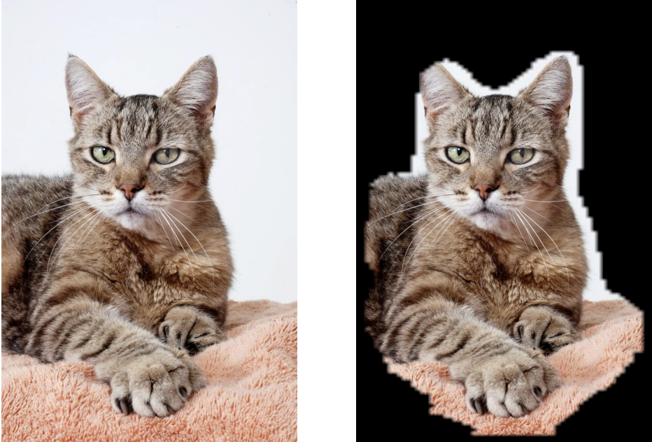

# background-remover

A deep U-net neural network that uses semantic segmentation to identity the background of an image!




## Model

We used the class U-net model: a series of convolutions, then transpose convolutions to reduce, then increase the dimensions of the image. Residual connections are used to propagate earlier weights later into the model to help with gradient vanishing. 

Since the network is fully convolutional, the U-net can take images of any image dimension. The only requirement is that the width and length are multiples of 32. 

The model was trained on 128 x 128 images. Thus, the dimensions of an inputted image is reduced to a multiple of 32 under 128 so that the image is more similar to that of the training data. The outputted mask is then scaled back to the original dimensions of the image. 

```
__________________________________________________________________________________________________
Layer (type)                    Output Shape         Param #     Connected to                     
==================================================================================================
input_1 (InputLayer)            [(None, 128, 128, 3) 0                                            
__________________________________________________________________________________________________
conv2d (Conv2D)                 (None, 128, 128, 64) 1792        input_1[0][0]                    
__________________________________________________________________________________________________
batch_normalization (BatchNorma (None, 128, 128, 64) 256         conv2d[0][0]                     
__________________________________________________________________________________________________
conv2d_1 (Conv2D)               (None, 128, 128, 64) 36928       batch_normalization[0][0]        
__________________________________________________________________________________________________
batch_normalization_1 (BatchNor (None, 128, 128, 64) 256         conv2d_1[0][0]                   
__________________________________________________________________________________________________
max_pooling2d (MaxPooling2D)    (None, 64, 64, 64)   0           batch_normalization_1[0][0]      
__________________________________________________________________________________________________
dropout (Dropout)               (None, 64, 64, 64)   0           max_pooling2d[0][0]              
__________________________________________________________________________________________________
conv2d_2 (Conv2D)               (None, 64, 64, 128)  73856       dropout[0][0]                    
__________________________________________________________________________________________________
batch_normalization_2 (BatchNor (None, 64, 64, 128)  512         conv2d_2[0][0]                   
__________________________________________________________________________________________________
conv2d_3 (Conv2D)               (None, 64, 64, 128)  147584      batch_normalization_2[0][0]      
__________________________________________________________________________________________________
batch_normalization_3 (BatchNor (None, 64, 64, 128)  512         conv2d_3[0][0]                   
__________________________________________________________________________________________________
max_pooling2d_1 (MaxPooling2D)  (None, 32, 32, 128)  0           batch_normalization_3[0][0]      
__________________________________________________________________________________________________
dropout_1 (Dropout)             (None, 32, 32, 128)  0           max_pooling2d_1[0][0]            
__________________________________________________________________________________________________
conv2d_4 (Conv2D)               (None, 32, 32, 256)  295168      dropout_1[0][0]                  
__________________________________________________________________________________________________
batch_normalization_4 (BatchNor (None, 32, 32, 256)  1024        conv2d_4[0][0]                   
__________________________________________________________________________________________________
conv2d_5 (Conv2D)               (None, 32, 32, 256)  590080      batch_normalization_4[0][0]      
__________________________________________________________________________________________________
batch_normalization_5 (BatchNor (None, 32, 32, 256)  1024        conv2d_5[0][0]                   
__________________________________________________________________________________________________
max_pooling2d_2 (MaxPooling2D)  (None, 16, 16, 256)  0           batch_normalization_5[0][0]      
__________________________________________________________________________________________________
dropout_2 (Dropout)             (None, 16, 16, 256)  0           max_pooling2d_2[0][0]            
__________________________________________________________________________________________________
conv2d_6 (Conv2D)               (None, 16, 16, 512)  1180160     dropout_2[0][0]                  
__________________________________________________________________________________________________
batch_normalization_6 (BatchNor (None, 16, 16, 512)  2048        conv2d_6[0][0]                   
__________________________________________________________________________________________________
conv2d_7 (Conv2D)               (None, 16, 16, 512)  2359808     batch_normalization_6[0][0]      
__________________________________________________________________________________________________
batch_normalization_7 (BatchNor (None, 16, 16, 512)  2048        conv2d_7[0][0]                   
__________________________________________________________________________________________________
max_pooling2d_3 (MaxPooling2D)  (None, 8, 8, 512)    0           batch_normalization_7[0][0]      
__________________________________________________________________________________________________
dropout_3 (Dropout)             (None, 8, 8, 512)    0           max_pooling2d_3[0][0]            
__________________________________________________________________________________________________
conv2d_8 (Conv2D)               (None, 8, 8, 512)    2359808     dropout_3[0][0]                  
__________________________________________________________________________________________________
batch_normalization_8 (BatchNor (None, 8, 8, 512)    2048        conv2d_8[0][0]                   
__________________________________________________________________________________________________
conv2d_9 (Conv2D)               (None, 8, 8, 512)    2359808     batch_normalization_8[0][0]      
__________________________________________________________________________________________________
batch_normalization_9 (BatchNor (None, 8, 8, 512)    2048        conv2d_9[0][0]                   
__________________________________________________________________________________________________
max_pooling2d_4 (MaxPooling2D)  (None, 4, 4, 512)    0           batch_normalization_9[0][0]      
__________________________________________________________________________________________________
dropout_4 (Dropout)             (None, 4, 4, 512)    0           max_pooling2d_4[0][0]            
__________________________________________________________________________________________________
conv2d_transpose (Conv2DTranspo (None, 8, 8, 512)    2359808     dropout_4[0][0]                  
__________________________________________________________________________________________________
tf.concat (TFOpLambda)          (None, 8, 8, 1024)   0           conv2d_transpose[0][0]           
                                                                 dropout_3[0][0]                  
__________________________________________________________________________________________________
dropout_5 (Dropout)             (None, 8, 8, 1024)   0           tf.concat[0][0]                  
__________________________________________________________________________________________________
conv2d_10 (Conv2D)              (None, 8, 8, 512)    4719104     dropout_5[0][0]                  
__________________________________________________________________________________________________
batch_normalization_10 (BatchNo (None, 8, 8, 512)    2048        conv2d_10[0][0]                  
__________________________________________________________________________________________________
conv2d_11 (Conv2D)              (None, 8, 8, 512)    2359808     batch_normalization_10[0][0]     
__________________________________________________________________________________________________
batch_normalization_11 (BatchNo (None, 8, 8, 512)    2048        conv2d_11[0][0]                  
__________________________________________________________________________________________________
conv2d_transpose_1 (Conv2DTrans (None, 16, 16, 256)  1179904     batch_normalization_11[0][0]     
__________________________________________________________________________________________________
tf.concat_1 (TFOpLambda)        (None, 16, 16, 512)  0           conv2d_transpose_1[0][0]         
                                                                 dropout_2[0][0]                  
__________________________________________________________________________________________________
dropout_6 (Dropout)             (None, 16, 16, 512)  0           tf.concat_1[0][0]                
__________________________________________________________________________________________________
conv2d_12 (Conv2D)              (None, 16, 16, 256)  1179904     dropout_6[0][0]                  
__________________________________________________________________________________________________
batch_normalization_12 (BatchNo (None, 16, 16, 256)  1024        conv2d_12[0][0]                  
__________________________________________________________________________________________________
conv2d_13 (Conv2D)              (None, 16, 16, 256)  590080      batch_normalization_12[0][0]     
__________________________________________________________________________________________________
batch_normalization_13 (BatchNo (None, 16, 16, 256)  1024        conv2d_13[0][0]                  
__________________________________________________________________________________________________
conv2d_transpose_2 (Conv2DTrans (None, 32, 32, 128)  295040      batch_normalization_13[0][0]     
__________________________________________________________________________________________________
tf.concat_2 (TFOpLambda)        (None, 32, 32, 256)  0           conv2d_transpose_2[0][0]         
                                                                 dropout_1[0][0]                  
__________________________________________________________________________________________________
dropout_7 (Dropout)             (None, 32, 32, 256)  0           tf.concat_2[0][0]                
__________________________________________________________________________________________________
conv2d_14 (Conv2D)              (None, 32, 32, 128)  295040      dropout_7[0][0]                  
__________________________________________________________________________________________________
batch_normalization_14 (BatchNo (None, 32, 32, 128)  512         conv2d_14[0][0]                  
__________________________________________________________________________________________________
conv2d_15 (Conv2D)              (None, 32, 32, 128)  147584      batch_normalization_14[0][0]     
__________________________________________________________________________________________________
batch_normalization_15 (BatchNo (None, 32, 32, 128)  512         conv2d_15[0][0]                  
__________________________________________________________________________________________________
conv2d_transpose_3 (Conv2DTrans (None, 64, 64, 64)   73792       batch_normalization_15[0][0]     
__________________________________________________________________________________________________
tf.concat_3 (TFOpLambda)        (None, 64, 64, 128)  0           conv2d_transpose_3[0][0]         
                                                                 dropout[0][0]                    
__________________________________________________________________________________________________
dropout_8 (Dropout)             (None, 64, 64, 128)  0           tf.concat_3[0][0]                
__________________________________________________________________________________________________
conv2d_16 (Conv2D)              (None, 64, 64, 64)   73792       dropout_8[0][0]                  
__________________________________________________________________________________________________
batch_normalization_16 (BatchNo (None, 64, 64, 64)   256         conv2d_16[0][0]                  
__________________________________________________________________________________________________
conv2d_17 (Conv2D)              (None, 64, 64, 64)   36928       batch_normalization_16[0][0]     
__________________________________________________________________________________________________
batch_normalization_17 (BatchNo (None, 64, 64, 64)   256         conv2d_17[0][0]                  
__________________________________________________________________________________________________
conv2d_transpose_4 (Conv2DTrans (None, 128, 128, 64) 36928       batch_normalization_17[0][0]     
__________________________________________________________________________________________________
dropout_9 (Dropout)             (None, 128, 128, 64) 0           conv2d_transpose_4[0][0]         
__________________________________________________________________________________________________
conv2d_18 (Conv2D)              (None, 128, 128, 64) 36928       dropout_9[0][0]                  
__________________________________________________________________________________________________
batch_normalization_18 (BatchNo (None, 128, 128, 64) 256         conv2d_18[0][0]                  
__________________________________________________________________________________________________
conv2d_19 (Conv2D)              (None, 128, 128, 64) 36928       batch_normalization_18[0][0]     
__________________________________________________________________________________________________
batch_normalization_19 (BatchNo (None, 128, 128, 64) 256         conv2d_19[0][0]                  
__________________________________________________________________________________________________
conv2d_20 (Conv2D)              (None, 128, 128, 1)  65          batch_normalization_19[0][0]     
==================================================================================================
Total params: 22,846,593
Trainable params: 22,836,609
Non-trainable params: 9,984
__________________________________________________________________________________________________
```

## Dataset
<a href='https://www.robots.ox.ac.uk/~vgg/data/pets/'>Oxford-IIIT Pet Dataset</a>